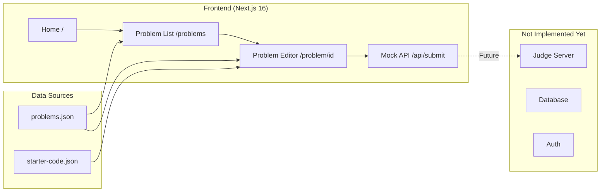
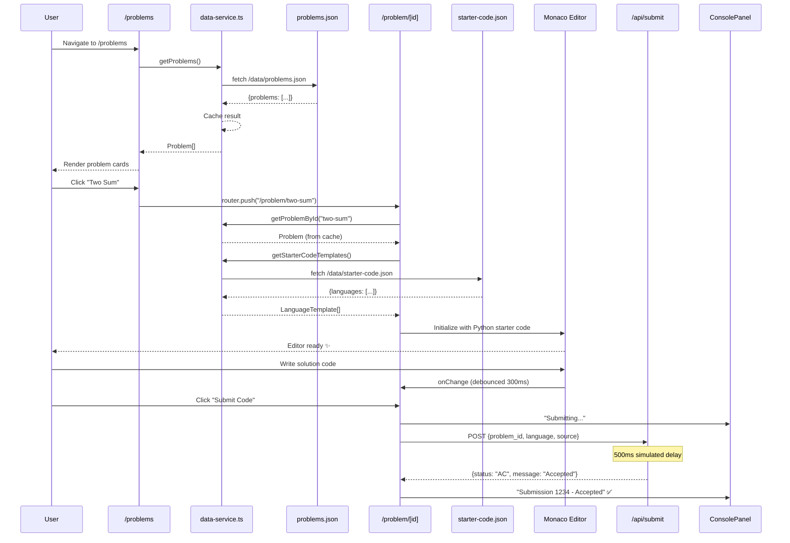

# Coding Arena — Complete Codebase Deep-Dive Summary

> **Date**: March 29, 2026  
> **Scope**: Entire repository (`coding_arena/`) — excluding `judge-server/` and `LICENSE`

---

## 1. High-Level Overview

**Coding Arena** is a **HackerRank-style competitive programming platform** built as a monorepo. The current implementation focuses entirely on the **frontend MVP** — a Next.js web application where users can browse coding problems, write solutions in a Monaco Editor (the engine behind VS Code), and submit code to a mock API that always returns "Accepted".



### Tech Stack

| Layer | Technology | Version |
|-------|-----------|---------|
| Framework | Next.js (App Router) | 16.2.1 |
| UI Library | React | 19.2.4 |
| Styling | Tailwind CSS | 4.x |
| Code Editor | Monaco Editor (@monaco-editor/react) | 4.7.0 |
| Layout | react-resizable-panels | 4.8.0 |
| Icons | lucide-react | 1.7.0 |
| XSS Protection | DOMPurify (isomorphic-dompurify) | 3.7.1 |
| Language | TypeScript | 5.x |

---

## 2. Repository Structure

```
coding_arena/
├── .kiro/                          # ⭐ Spec-driven development (Kiro)
│   ├── docs/                       # Project documentation
│   │   ├── CLEANUP-SUMMARY.md      # What was removed during cleanup
│   │   ├── MONACO-EDITOR-ISSUES.md # Deep-dive on Monaco worker errors
│   │   ├── PROJECT-STRUCTURE.md    # File-by-file structure guide
│   │   └── PROJECT-SUMMARY.md      # High-level project overview
│   └── specs/
│       └── monaco-editor-integration/
│           ├── .config.kiro        # Spec metadata (UUID, workflow type)
│           ├── requirements.md     # 14 formal requirements with acceptance criteria
│           ├── design.md           # Full architecture/design document (~941 lines)
│           └── tasks.md            # Implementation task checklist (all ✅)
│
├── frontend/                       # ⭐ The actual Next.js application
│   ├── app/                        # Next.js App Router pages
│   │   ├── api/submit/route.ts     # Mock submission API endpoint
│   │   ├── problem/[id]/page.tsx   # Problem detail + editor page
│   │   ├── problems/page.tsx       # Problem listing page
│   │   ├── layout.tsx              # Root layout (fonts, HTML shell)
│   │   ├── page.tsx                # Home page (default Next.js template)
│   │   ├── not-found.tsx           # Custom 404 page
│   │   ├── globals.css             # Global styles
│   │   └── favicon.ico
│   │
│   ├── components/                 # React components
│   │   ├── CodeEditorPanel.tsx     # Monaco Editor wrapper (lazy-loaded, memoized)
│   │   ├── ConsolePanel.tsx        # Submission results display
│   │   ├── ProblemPanel.tsx        # Problem description renderer
│   │   └── ErrorBoundary.tsx       # React error boundary
│   │
│   ├── lib/                        # Utility layer
│   │   └── data-service.ts         # Data fetching, caching, validation
│   │
│   ├── public/
│   │   └── data/
│   │       ├── problems.json       # 5 sample problems
│   │       └── starter-code.json   # Templates for C, C++, Java, Python
│   │
│   ├── package.json                # Dependencies & scripts
│   ├── next.config.ts              # CSP headers & security config
│   ├── tsconfig.json               # TypeScript config (strict mode)
│   ├── eslint.config.mjs           # ESLint config
│   ├── postcss.config.mjs          # PostCSS (Tailwind)
│   ├── README.md                   # Frontend documentation
│   ├── QUICK-START.md              # 2-minute setup guide
│   └── .gitignore
│
├── judge-server/                   # ❌ NOT IN SCOPE (separate project)
└── LICENSE                         # ❌ NOT IN SCOPE (MIT license)
```

---

## 3. The Kiro Spec System (`.kiro/`)

> [!IMPORTANT]
> The `.kiro/` folder implements a **spec-driven development workflow** — a structured, design-first approach where every feature starts with requirements, gets a formal design, and is tracked via implementation tasks.

### 3.1 Workflow Type: `design-first`

The `.config.kiro` file defines:
```json
{"specId": "4b726b1b-9a36-4cdb-84c8-5f834a40a2ba", "workflowType": "design-first", "specType": "feature"}
```

This means: **Requirements → Design → Tasks** (formal, waterfall-style flow).

### 3.2 Requirements ([requirements.md](file:///c:/Users/sparg/Documents/coding_arena/.kiro/specs/monaco-editor-integration/requirements.md))

14 formal requirements, each structured as:
- **User Story** (As a user/developer, I want...)
- **Acceptance Criteria** (WHEN/THEN/IF formal conditions)

| # | Requirement | Key Criteria |
|---|------------|--------------|
| 1 | JSON-Driven Problem Data | Load from `problems.json`, no hardcoded data |
| 2 | JSON-Driven Starter Code | Load from `starter-code.json`, 4 languages |
| 3 | Problem Listing Page | Grid layout, filter by difficulty/category |
| 4 | Split-Panel Editor Interface | Resizable panels, problem + editor + console |
| 5 | Monaco Editor Integration | Syntax highlighting, dark theme, line numbers |
| 6 | Language Selection | Python default, switch loads new starter code |
| 7 | Code Submission | POST to `/api/submit`, validate non-empty code |
| 8 | Mock API Response | Always return `status: "AC"`, `message: "Accepted"` |
| 9 | Console Panel | Display messages (info/success/error), clear button |
| 10 | Problem Description Display | Title, description, I/O format, constraints, examples |
| 11 | Error Handling | Retry logic, fallback UI, 404 for invalid IDs |
| 12 | Payload Validation | Validate `problem_id`, `language`, `source` before submit |
| 13 | Performance | Lazy load Monaco, debounce onChange, cache JSON |
| 14 | Security | XSS sanitization, CSP headers, path traversal protection |

### 3.3 Design ([design.md](file:///c:/Users/sparg/Documents/coding_arena/.kiro/specs/monaco-editor-integration/design.md))

A **941-line** formal design document containing:

- **Architecture diagram** (Mermaid) showing data flow
- **Sequence diagram** for the full user workflow
- **6 component interfaces** with TypeScript types:
  - `ProblemListPage`, `EditorPage`, `ProblemPanel`, `CodeEditorPanel`, `ConsolePanel`, `SubmissionService`
- **Data models** with validation rules
- **3 key function specifications** with formal pre/post-conditions
- **Algorithmic pseudocode** for submission, editor init, starter code loading
- **13 correctness properties** (formal invariants mapped to requirements)
- **Error handling scenarios** (4 documented)
- **Testing strategy** (unit, property-based with fast-check, integration)
- **Performance & security considerations**
- **Full dependency list** with version ranges

### 3.4 Tasks ([tasks.md](file:///c:/Users/sparg/Documents/coding_arena/.kiro/specs/monaco-editor-integration/tasks.md))

16 top-level tasks, **all marked complete** (`[x]`). The task list includes:

1. ✅ Project structure & data files
2. ✅ Dummy API endpoint
3. ✅ Data loading utilities
4. ✅ Problem listing page
5. ✅ Checkpoint
6. ✅ Problem panel component
7. ✅ Monaco Editor component
8. ✅ Console panel component
9. ✅ Editor page with split-panel layout
10. ✅ Submission workflow
11. ✅ Checkpoint
12. ✅ Security & validation
13. ✅ Performance optimizations
14. ✅ Error handling & fallbacks
15. ✅ Final integration & polish
16. ✅ Final checkpoint

### 3.5 Documentation ([docs/](file:///c:/Users/sparg/Documents/coding_arena/.kiro/docs))

4 documentation files capturing:
- **CLEANUP-SUMMARY.md**: What was removed (30+ test files, test dependencies) and what was created
- **MONACO-EDITOR-ISSUES.md**: Root cause analysis of Monaco worker errors, 6 attempted solutions, current status
- **PROJECT-STRUCTURE.md**: Detailed file-by-file explanation
- **PROJECT-SUMMARY.md**: High-level overview, architecture decisions, lessons learned

---

## 4. Frontend Deep Dive — Every File Analyzed

### 4.1 Configuration Layer

#### [package.json](file:///c:/Users/sparg/Documents/coding_arena/frontend/package.json)
- **Scripts**: `dev`, `build`, `start`, `lint` (no test scripts — removed during cleanup)
- **8 production deps**: next, react, react-dom, @monaco-editor/react, dompurify, isomorphic-dompurify, lucide-react, react-resizable-panels
- **8 dev deps**: tailwindcss, postcss, typescript, eslint, type definitions

#### [next.config.ts](file:///c:/Users/sparg/Documents/coding_arena/frontend/next.config.ts)
Implements comprehensive **security headers** applied to all routes (`/:path*`):

| Header | Value | Purpose |
|--------|-------|---------|
| `Content-Security-Policy` | Multi-directive policy | XSS/injection prevention |
| `X-Content-Type-Options` | `nosniff` | MIME type sniffing prevention |
| `X-Frame-Options` | `DENY` | Clickjacking prevention |
| `X-XSS-Protection` | `1; mode=block` | Legacy XSS filter |
| `Referrer-Policy` | `strict-origin-when-cross-origin` | Referrer leakage prevention |

**CSP Directives** of note:
- `worker-src 'self' blob:` — enables Monaco's Web Workers
- `script-src 'self' 'unsafe-eval' 'unsafe-inline'` — required by Next.js + Monaco
- `frame-src 'none'` — no iframes allowed

#### [tsconfig.json](file:///c:/Users/sparg/Documents/coding_arena/frontend/tsconfig.json)
- Target: ES2017
- Strict mode enabled
- Path alias: `@/*` → `./*`
- JSX: `react-jsx`
- Module resolution: `bundler`

#### [globals.css](file:///c:/Users/sparg/Documents/coding_arena/frontend/app/globals.css)
- Imports Tailwind CSS v4 (`@import "tailwindcss"`)
- CSS custom properties for light/dark mode backgrounds
- Uses `@theme inline` for Tailwind theme integration
- Dark mode via `prefers-color-scheme: dark`

---

### 4.2 Pages (App Router)

#### [layout.tsx](file:///c:/Users/sparg/Documents/coding_arena/frontend/app/layout.tsx) — Root Layout
- **Server Component** (no `'use client'`)
- Loads **Geist Sans** and **Geist Mono** fonts from Google Fonts
- Sets CSS variables `--font-geist-sans` and `--font-geist-mono`
- Metadata: `title: "Create Next App"` (still default — not customized)
- Body: `min-h-full flex flex-col` for full-height layout

#### [page.tsx](file:///c:/Users/sparg/Documents/coding_arena/frontend/app/page.tsx) — Home Page (`/`)
- **Server Component**
- Still the **default Next.js template** — displays Next.js logo, "Deploy Now", and "Documentation" buttons
- Links to Vercel templates and Next.js learning center
- Dark/light mode support via Tailwind `dark:` classes

> [!NOTE]
> The home page hasn't been customized. It's the stock Next.js starter. The real entry point is `/problems`.

#### [not-found.tsx](file:///c:/Users/sparg/Documents/coding_arena/frontend/app/not-found.tsx) — 404 Page
- **Server Component**
- Dark-themed full-screen layout
- Shows "404 — Problem Not Found" with a "Back to Problems" link
- Hover/focus animations on the CTA button
- Accessible: focus ring with offset

#### [problems/page.tsx](file:///c:/Users/sparg/Documents/coding_arena/frontend/app/problems/page.tsx) — Problem List (`/problems`)
- **Client Component** (`'use client'`)
- **State Management**:
  - `problems: Problem[]` — loaded from JSON
  - `loading: boolean` — loading indicator
  - `error: string | null` — error message
  - `difficultyFilter: string` — "All" | "Easy" | "Medium" | "Hard"
  - `categoryFilter: string` — "All" | dynamic from data

- **Key Behaviors**:
  - `loadProblems()` — calls `getProblems()` from data service
  - `useMemo` for unique categories extraction
  - `useMemo` for filtered problems (difficulty + category intersection)
  - `handleProblemClick()` — navigates via `router.push('/problem/${id}')`
  - `getDifficultyColor()` — maps difficulty to Tailwind color classes

- **UI States**:
  1. **Loading**: Spinner + 6 skeleton cards (animated pulse)
  2. **Error**: Red error banner with retry button
  3. **Loaded**: Responsive grid (1/2/3 cols), filter controls, result count, problem cards

- **Problem Cards**: Show title, difficulty (color-coded), category, points, solved count
- **Accessibility**: Cards are keyboard-navigable (`role="button"`, `tabIndex={0}`, Enter/Space handlers)
- Wrapped in `ErrorBoundary`

#### [problem/[id]/page.tsx](file:///c:/Users/sparg/Documents/coding_arena/frontend/app/problem/%5Bid%5D/page.tsx) — Problem Editor (`/problem/:id`)
- **Client Component** — the most complex page (330 lines)
- **Params**: Uses `Promise<{ id: string }>` pattern (Next.js 16 async params)

- **State Management** (8 state variables):
  ```
  problemId, problem, starterCodeTemplates, code, language, 
  consoleMessages, isSubmitting, isLoading, error
  ```

- **Data Loading** (`loadData()`):
  1. Unwrap params promise → set `problemId`
  2. Fetch problem by ID via `getProblemById()`
  3. If not found → redirect to `/not-found`
  4. Fetch starter code templates via `getStarterCodeTemplates()`
  5. Initialize `code` with Python starter code (default language)

- **Language Change** (`handleLanguageChange()`):
  - Updates language state
  - Finds matching template in `starterCodeTemplates`
  - Replaces editor content with new starter code

- **Code Submission** (`handleSubmit()`):
  1. Validates code is non-empty
  2. Sets `isSubmitting = true`, shows "Submitting..." in console
  3. POSTs to `/api/submit` with `{ problem_id, language, source }`
  4. On success: displays `"Submission {id} - Accepted"`
  5. On error: displays error message
  6. Finally: re-enables submit button

- **Layout** (uses `react-resizable-panels`):
  ```
  ┌─────────────────────────────────────────┐
  │ <Group horizontal>                       │
  │ ┌──────────┬──┬────────────────────────┐│
  │ │ Problem  │  │ <Group vertical>       ││
  │ │ Panel    │  │ ┌──────────────────┐   ││
  │ │ (40%)    │  │ │ Code Editor      │   ││
  │ │          │  │ │ (70%)            │   ││
  │ │          │  │ │                  │   ││
  │ │          │  │ ├──────────────────┤   ││
  │ │          │  │ │ [Submit Button]  │   ││
  │ │          │  │ ├────── ──────────┤   ││
  │ │          │  │ │ Console          │   ││
  │ │          │  │ │ (30%)            │   ││
  │ │          │  │ └──────────────────┘   ││
  │ └──────────┴──┴────────────────────────┘│
  └─────────────────────────────────────────┘
  ```
  - Left panel: `ProblemPanel` (40%, min 25%)
  - Right panel (60%, min 35%): vertical split of editor (70%, min 30%) + console (30%, min 15%)
  - Separators styled with hover effects (gray → blue)
  - Each section wrapped in its own `ErrorBoundary` with custom fallback UI
  - Editor fallback: plain `<textarea>`

---

### 4.3 Components

#### [CodeEditorPanel.tsx](file:///c:/Users/sparg/Documents/coding_arena/frontend/components/CodeEditorPanel.tsx)
The Monaco Editor wrapper — the core of the coding experience.

**Key Implementation Details**:

1. **Lazy Loading**: Uses Next.js `dynamic()` with `ssr: false` to avoid server-side rendering issues with Monaco
   ```tsx
   const Editor = dynamic(() => import('@monaco-editor/react'), { ssr: false, loading: () => <Spinner /> })
   ```

2. **Debounced onChange**: 300ms debounce to reduce re-renders during rapid typing
   ```tsx
   debounceTimerRef.current = setTimeout(() => { onChange(value || '') }, debounceDelay)
   ```

3. **Memory Leak Prevention**: Cleanup on unmount disposes the editor instance and clears timers
   ```tsx
   useEffect(() => () => { clearTimeout(debounceTimerRef.current); editorRef.current?.dispose() }, [])
   ```

4. **Editor Options**:
   - Theme: `vs-dark`
   - Font size: 14
   - Line numbers: on
   - Minimap: enabled
   - Automatic layout: true (handles resize)
   - Tab size: 4

5. **Language Selector**: Dropdown rendered above editor when `availableLanguages` + `onLanguageChange` are provided

6. **Performance**: Entire component wrapped in `React.memo()`

**Props Interface**:
```typescript
interface CodeEditorPanelProps {
  value: string              // Current editor content
  language: string           // Language mode (python, cpp, etc.)
  onChange: (value) => void  // Content change handler
  onLanguageChange?: (lang) => void  // Language switch handler
  availableLanguages?: LanguageTemplate[]  // Language options
  readOnly?: boolean         // Read-only mode
  debounceDelay?: number     // Debounce delay (default 300ms)
}
```

#### [ProblemPanel.tsx](file:///c:/Users/sparg/Documents/coding_arena/frontend/components/ProblemPanel.tsx)
Renders the full problem description in the left panel.

**Security**: Uses `DOMPurify.sanitize()` (via `isomorphic-dompurify`) on:
- `problem.description`
- `problem.inputFormat`
- `problem.outputFormat`

Each sanitization result is `useMemo`-ized to avoid re-computation.

**Rendered Sections**:
1. **Title** (`<h1>`)
2. **Metadata**: Difficulty (color-coded), category, points
3. **Description**: Sanitized HTML via `dangerouslySetInnerHTML`
4. **Input Format**: Sanitized HTML
5. **Output Format**: Sanitized HTML
6. **Constraints**: Bullet list from array
7. **Examples**: Cards with Input, Output, and optional Explanation (each in `<pre>` blocks)
8. **Limits**: Time limit (ms) and memory limit (MB)

Wrapped in `React.memo()`.

#### [ConsolePanel.tsx](file:///c:/Users/sparg/Documents/coding_arena/frontend/components/ConsolePanel.tsx)
Displays submission results in the bottom panel.

**Key Features**:
- **XSS Protection**: All messages sanitized via `DOMPurify.sanitize()` before rendering
- **Message Types**: `info` (blue), `success` (green), `error` (red) — each with distinct background/border colors
- **Timestamps**: Formatted as HH:MM:SS (24-hour)
- **Clear Button**: Uses `lucide-react` `X` icon, with accessible `aria-label`
- **Empty State**: Italicized "Console output will appear here..."

> [!WARNING]
> Messages are rendered with `dangerouslySetInnerHTML` — but this is safe because DOMPurify strips all dangerous content first.

Wrapped in `React.memo()`.

#### [ErrorBoundary.tsx](file:///c:/Users/sparg/Documents/coding_arena/frontend/components/ErrorBoundary.tsx)
Class-based React error boundary (required for `componentDidCatch`).

**Features**:
- Accepts optional `fallback` ReactNode prop for custom error UI
- Accepts optional `onError` callback for error reporting
- Default fallback: "Something went wrong" + error message + "Try Again" button
- `handleReset()` clears error state to allow retry
- Dark-themed error display consistent with rest of app

---

### 4.4 Data Layer

#### [data-service.ts](file:///c:/Users/sparg/Documents/coding_arena/frontend/lib/data-service.ts)
The centralized data fetching and validation service (316 lines). This is the **backbone** of the application.

**TypeScript Interfaces Exported**:
```typescript
Problem         // id, title, difficulty, category, points, solvedCount, description, etc.
TestExample     // input, output, explanation?
LanguageTemplate // id, name, monacoId, extension, starterCode
SubmissionPayload // problem_id, language, source
SubmissionResult  // submission_id, status, message, timestamp
```

**Caching System**:
- Module-level variables: `problemsCache` and `starterCodeCache`
- Functions to invalidate: `invalidateProblemsCache()`, `invalidateStarterCodeCache()`, `invalidateAllCaches()`
- Cache-first strategy: if cache exists, return immediately without network request

**Data Fetching Functions**:

| Function | Fetches | Retry | Cache |
|----------|---------|-------|-------|
| `getProblems()` | `/data/problems.json` | 3 retries, 1s delay | ✅ |
| `getProblemById(id)` | Uses `getProblems()` + `.find()` | Via parent | ✅ |
| `getStarterCodeTemplates()` | `/data/starter-code.json` | 3 retries, 1s delay | ✅ |

**Validation Functions** (private):

| Function | Validates | Checks |
|----------|-----------|--------|
| `validateProblemId()` | Problem ID | Non-empty, no special chars, no `..` path traversal |
| `validateLanguage()` | Language string | Must be `c`, `cpp`, `java`, or `python` |
| `validateSourceCode()` | Source code | Non-empty, strips null bytes |

**`submitCode()` Function**:
1. Validates all 3 inputs
2. Constructs sanitized payload
3. POSTs to `/api/submit`
4. Returns typed `SubmissionResult`
5. Wraps errors in descriptive messages

---

### 4.5 API Routes

#### [api/submit/route.ts](file:///c:/Users/sparg/Documents/coding_arena/frontend/app/api/submit/route.ts)
The mock submission endpoint.

**Behavior**:
1. Receives POST with `{ problem_id, language, source }`
2. Simulates 500ms processing delay
3. Returns:
   ```json
   {
     "submission_id": <timestamp>,
     "status": "AC",
     "message": "Accepted",
     "timestamp": <timestamp>
   }
   ```
4. On parse error: returns `{ error: "Invalid request" }` with HTTP 400

> [!NOTE]
> This is intentionally a mock. No actual code execution happens. The `submission_id` is just `Date.now()`. This is designed to be replaced with a real judge server integration later.

---

### 4.6 Static Data

#### [problems.json](file:///c:/Users/sparg/Documents/coding_arena/frontend/public/data/problems.json)
Contains **5 sample problems**:

| ID | Title | Difficulty | Category | Points |
|----|-------|-----------|----------|--------|
| `two-sum` | Two Sum | Easy | Arrays | 100 |
| `reverse-string` | Reverse String | Easy | Strings | 50 |
| `valid-parentheses` | Valid Parentheses | Medium | Stack | 200 |
| `merge-sorted-arrays` | Merge Two Sorted Arrays | Medium | Arrays | 150 |
| `longest-substring` | Longest Substring Without Repeating Characters | Hard | Strings | 300 |

Each problem has complete fields: description, I/O format, constraints, 2-3 examples with explanations, time/memory limits.

#### [starter-code.json](file:///c:/Users/sparg/Documents/coding_arena/frontend/public/data/starter-code.json)
Contains starter templates for **4 languages**:

| Language | Includes | Template |
|----------|----------|----------|
| C | `stdio.h`, `stdlib.h` | `main()` with return 0 |
| C++ | `iostream`, `vector`, `string`, `using namespace std` | `main()` with return 0 |
| Java | `java.util.*`, `java.io.*` | `public class Solution { main() }` |
| Python | Comment only | `# Write your code here` |

---

## 5. Data Flow — End to End



---

## 6. Security Architecture

| Layer | Mechanism | Implementation |
|-------|-----------|----------------|
| **XSS Prevention** | DOMPurify sanitization | `ProblemPanel.tsx`, `ConsolePanel.tsx` — all HTML content sanitized before `dangerouslySetInnerHTML` |
| **CSP Headers** | Content-Security-Policy | `next.config.ts` — restricts script/style/worker origins |
| **Input Validation** | Server-side validation | `data-service.ts` — validates problem IDs, languages, source code |
| **Path Traversal** | Regex validation | `validateProblemId()` — rejects `..`, special chars, control chars |
| **Clickjacking** | X-Frame-Options | `DENY` header on all routes |
| **MIME Sniffing** | X-Content-Type-Options | `nosniff` header |
| **Referrer Leakage** | Referrer-Policy | `strict-origin-when-cross-origin` |

---

## 7. Performance Optimizations

| Optimization | Where | Impact |
|-------------|-------|--------|
| **Lazy Loading** | `CodeEditorPanel.tsx` — `dynamic()` with `ssr: false` | Reduces initial bundle by ~2MB (Monaco) |
| **Debounced onChange** | `CodeEditorPanel.tsx` — 300ms debounce | Reduces re-renders during typing |
| **React.memo()** | `CodeEditorPanel`, `ConsolePanel`, `ProblemPanel` | Prevents re-renders when props unchanged |
| **useMemo()** | `ProblemsPage` (filters), `ProblemPanel` (sanitization), `ConsolePanel` (sanitization) | Avoids recomputation |
| **Data Caching** | `data-service.ts` — module-level cache | Eliminates redundant JSON fetches |
| **Retry Logic** | `data-service.ts` — 3 retries with 1s delay | Resilience against transient failures |
| **automaticLayout** | Monaco Editor option | Handles resize without manual `layout()` calls |

---

## 8. Known Issues

### Monaco Editor Worker Warnings

**Symptoms**: Console warnings during development:
```
[browser] Monaco initialization: error: [object Event]
[browser] "⨯ unhandledRejection:" [object Event]
```

**Root Cause**: Monaco's Web Workers fail to load in Next.js 16 + Turbopack because:
1. Worker file paths don't exist in the Next.js build
2. SSR conflicts with worker initialization
3. Turbopack bundles differently than webpack

**Impact**: **None on functionality**. Editor works perfectly — syntax highlighting, editing, language switching all work. Advanced features (IntelliSense, validation) may be limited since workers run in the main thread.

**6 attempted fixes** documented in [MONACO-EDITOR-ISSUES.md](file:///c:/Users/sparg/Documents/coding_arena/.kiro/docs/MONACO-EDITOR-ISSUES.md):
1. ✅ Disable SSR (partial — editor loads, warnings persist)
2. ❌ Configure MonacoEnvironment
3. ❌ Use CDN for Workers (CORS issues)
4. ❌ Global Script Configuration
5. ⚠️ Error Suppression (cosmetic only)
6. ❌ Mock Worker Objects

**Decision**: Accept warnings. They're development-only and don't affect users.

### Home Page Not Customized
The root `/` page still shows the default Next.js template. The actual app entry is `/problems`.

### No Real Code Execution
The submit API always returns "Accepted" regardless of code. The `judge-server` folder exists but is not integrated.

---

## 9. Architecture Decisions & Patterns

| Decision | Rationale |
|----------|-----------|
| **Next.js App Router** | Modern React patterns, built-in routing, server/client component separation |
| **Monaco Editor over CodeMirror** | Industry standard (VS Code engine), richer feature set |
| **JSON files over database** | Simple MVP approach, version-controllable, easy to migrate later |
| **Mock API over no API** | Allows full workflow testing, easy to swap for real backend |
| **DOMPurify for XSS** | Battle-tested library, works isomorphically (SSR + client) |
| **react-resizable-panels** | Smooth, accessible panel resizing with min-size constraints |
| **Tailwind CSS** | Rapid styling, built-in dark mode, responsive utilities |
| **Module-level caching** | Simplest cache strategy, avoids external deps (no Redis/etc.) |
| **Class-based ErrorBoundary** | React requires class components for `componentDidCatch` |

---

## 10. What's Missing / Future Work

| Area | Status | Notes |
|------|--------|-------|
| Judge Server Integration | 🔴 Not started | `judge-server/` folder exists but not connected |
| User Authentication | 🔴 Not started | No login/signup |
| Submission History | 🔴 Not started | No database, no persistence |
| Real Test Case Execution | 🔴 Not started | Mock API only |
| Home Page | 🟡 Default template | Needs custom landing page |
| Unit/Integration Tests | 🔴 Removed | Were present, removed during cleanup for simplicity |
| Leaderboards | 🔴 Not started | |
| Discussion Forums | 🔴 Not started | |
| Contest Mode | 🔴 Not started | |
| Mobile App | 🔴 Not started | Web-only currently |

---

## 11. How to Run

```bash
cd frontend
npm install
npm run dev
# Open http://localhost:3000/problems
```

**Key URLs**:
- `/` — Home (default Next.js page)
- `/problems` — Problem list (the real entry point)
- `/problem/two-sum` — Example problem editor
- `/problem/reverse-string` — Another problem
- `/api/submit` — Mock submission endpoint (POST only)
