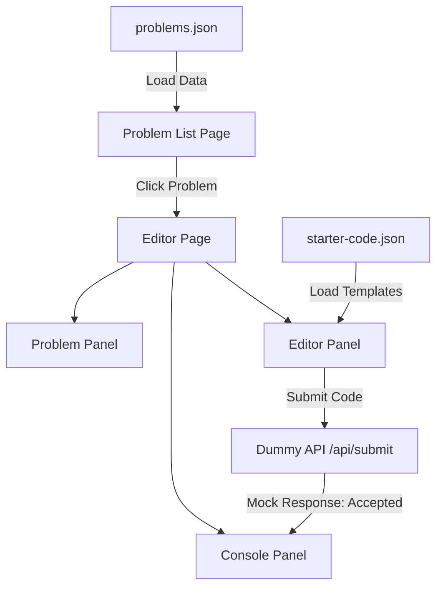
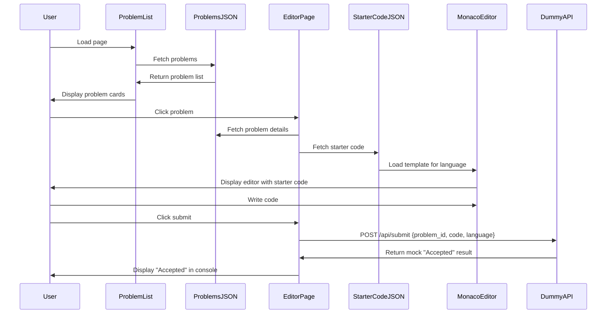

# Design Document: Monaco Editor Integration

## Overview

This design outlines a coding arena platform frontend inspired by HackerRank's UI, featuring a problem listing page and a split-panel editor interface. The platform integrates Monaco Editor for code editing with support for C/C++/Java/Python. All problem data and starter code templates are loaded from JSON files to ensure fully dynamic rendering with no hardcoded elements. Submissions are sent to a dummy API endpoint with mock "Accepted" responses for now (no backend/judge server integration in this phase).

## Architecture

The application follows a Next.js App Router architecture with client-side components for interactive features and server components for data fetching.



## Main Workflow



## Components and Interfaces

### Component 0: Data Sources (JSON Files)

**Purpose**: Provide dynamic data for problems and starter code templates

**problems.json Structure**:
```typescript
interface ProblemsData {
  problems: Problem[]
}

interface Problem {
  id: string
  title: string
  difficulty: 'Easy' | 'Medium' | 'Hard'
  category: string
  points: number
  solvedCount: number
  description: string
  inputFormat: string
  outputFormat: string
  constraints: string[]
  examples: TestExample[]
  timeLimit: number
  memoryLimit: number
}

interface TestExample {
  input: string
  output: string
  explanation?: string
}
```

**starter-code.json Structure**:
```typescript
interface StarterCodeData {
  languages: LanguageTemplate[]
}

interface LanguageTemplate {
  id: string
  name: string
  monacoId: string
  extension: string
  starterCode: string
}
```

**Example starter-code.json**:
```json
{
  "languages": [
    {
      "id": "cpp",
      "name": "C++",
      "monacoId": "cpp",
      "extension": ".cpp",
      "starterCode": "#include <iostream>\nusing namespace std;\n\nint main() {\n    // Write your code here\n    return 0;\n}"
    },
    {
      "id": "c",
      "name": "C",
      "monacoId": "c",
      "extension": ".c",
      "starterCode": "#include <stdio.h>\n\nint main() {\n    // Write your code here\n    return 0;\n}"
    },
    {
      "id": "java",
      "name": "Java",
      "monacoId": "java",
      "extension": ".java",
      "starterCode": "public class Solution {\n    public static void main(String[] args) {\n        // Write your code here\n    }\n}"
    },
    {
      "id": "python",
      "name": "Python",
      "monacoId": "python",
      "extension": ".py",
      "starterCode": "# Write your code here\n"
    }
  ]
}
```

### Component 1: ProblemListPage

**Purpose**: Display available coding problems from problems.json

**Interface**:
```typescript
interface ProblemListPageProps {
  // No props - fetches from problems.json
}

interface ProblemCardData {
  id: string
  title: string
  difficulty: 'Easy' | 'Medium' | 'Hard'
  category: string
  points: number
  solvedCount: number
}
```

**Responsibilities**:
- Load problems from `/data/problems.json`
- Display problems in grid/card layout
- Filter/search problems by difficulty, category
- Navigate to `/problem/[id]` on problem selection
- Show problem metadata dynamically (no hardcoded values)

### Component 2: EditorPage

**Purpose**: Main coding interface with split panels, loads data from JSON

**Interface**:
```typescript
interface EditorPageProps {
  problemId: string
}

interface EditorState {
  code: string
  language: string
  isSubmitting: boolean
  consoleOutput: ConsoleMessage[]
  problemData: ProblemDetail | null
  starterCodeTemplates: LanguageTemplate[]
}

interface ConsoleMessage {
  type: 'info' | 'success' | 'error' | 'result'
  message: string
  timestamp: number
}
```

**Responsibilities**:
- Load problem details from problems.json by problemId
- Load starter code templates from starter-code.json
- Manage layout with resizable panels
- Coordinate between problem, editor, and console components
- Handle submission workflow with dummy API
- Manage editor state (code, language selection)
- Initialize editor with starter code based on selected language

### Component 3: ProblemPanel

**Purpose**: Display problem description and constraints

**Interface**:
```typescript
interface ProblemPanelProps {
  problem: ProblemDetail
}

interface ProblemDetail {
  id: string
  title: string
  description: string
  inputFormat: string
  outputFormat: string
  constraints: string[]
  examples: TestExample[]
  timeLimit: number
  memoryLimit: number
}

interface TestExample {
  input: string
  output: string
  explanation?: string
}
```

**Responsibilities**:
- Render problem statement with formatting
- Display input/output examples
- Show constraints and limits
- Provide tabs for description, editorial, submissions

### Component 4: CodeEditorPanel

**Purpose**: Monaco Editor integration with language support from JSON

**Interface**:
```typescript
interface CodeEditorPanelProps {
  value: string
  language: string
  onChange: (value: string) => void
  onLanguageChange: (language: string) => void
  availableLanguages: LanguageTemplate[]
  readOnly?: boolean
}

interface LanguageTemplate {
  id: string
  name: string
  monacoId: string
  extension: string
  starterCode: string
}
```

**Responsibilities**:
- Initialize and configure Monaco Editor
- Provide syntax highlighting for C/C++/Java/Python
- Handle code changes and emit to parent
- Support language switching with starter code loading
- Provide editor features (autocomplete, formatting, minimap)
- Load starter code from JSON when language changes

### Component 5: ConsolePanel

**Purpose**: Display submission results (mock "Accepted" for now)

**Interface**:
```typescript
interface ConsolePanelProps {
  messages: ConsoleMessage[]
  onClear: () => void
}

interface MockSubmissionResult {
  submissionId: number
  status: 'AC' // Always "Accepted" for now
  message: string
  timestamp: number
}
```

**Responsibilities**:
- Display submission status messages
- Show mock "Accepted" result after submission
- Provide clear console functionality
- Display submission timestamp

### Component 6: SubmissionService

**Purpose**: Handle dummy API communication (mock responses)

**Interface**:
```typescript
interface SubmissionRequest {
  problemId: string
  code: string
  language: string
}

interface SubmissionService {
  submitCode(request: SubmissionRequest): Promise<MockSubmissionResult>
  getProblems(): Promise<Problem[]>
  getProblemDetail(problemId: string): Promise<ProblemDetail>
  getStarterCode(): Promise<LanguageTemplate[]>
}

interface MockSubmissionResult {
  submissionId: number
  status: 'AC'
  message: string
  timestamp: number
}
```

**Responsibilities**:
- Make HTTP POST to dummy API endpoint `/api/submit`
- Return mock "Accepted" response
- Load problems from `/data/problems.json`
- Load starter code from `/data/starter-code.json`
- Handle error scenarios gracefully

## Data Models

### Submission Request (Frontend → Dummy API)

```typescript
interface SubmissionPayload {
  problem_id: string
  language: string
  source: string
}
```

**Validation Rules**:
- `problem_id` must be non-empty string
- `language` must be one of: 'c', 'cpp', 'java', 'python'
- `source` must be non-empty string

### Submission Response (Dummy API → Frontend)

```typescript
interface MockSubmissionResponse {
  submission_id: number
  status: 'AC'
  message: 'Accepted'
  timestamp: number
}
```

**Validation Rules**:
- `submission_id` is auto-generated (e.g., Date.now())
- `status` is always 'AC' (Accepted)
- `message` is always 'Accepted'
- `timestamp` is current time

## Key Functions with Formal Specifications

### Function 1: submitCode()

```typescript
async function submitCode(
  problemId: string,
  code: string,
  language: string
): Promise<MockSubmissionResult>
```

**Preconditions:**
- `problemId` is non-empty string
- `code` is non-empty string
- `language` is one of: 'c', 'cpp', 'java', 'python'
- Dummy API endpoint exists

**Postconditions:**
- Returns valid `MockSubmissionResult` object
- `result.status` is always 'AC'
- `result.message` is 'Accepted'
- `result.submissionId` is positive integer
- No side effects on input parameters

**Loop Invariants:** N/A (async function, no loops)

### Function 2: initializeMonacoEditor()

```typescript
function initializeMonacoEditor(
  container: HTMLElement,
  initialValue: string,
  language: string,
  onChange: (value: string) => void
): monaco.editor.IStandaloneCodeEditor
```

**Preconditions:**
- `container` is valid mounted DOM element
- `container` has non-zero dimensions
- `language` is valid Monaco language identifier
- `onChange` is callable function

**Postconditions:**
- Returns initialized Monaco editor instance
- Editor is rendered in container
- Editor value equals `initialValue`
- Editor language equals `language`
- onChange callback is registered
- Editor is ready for user interaction

**Loop Invariants:** N/A

### Function 3: loadStarterCode()

```typescript
function loadStarterCode(
  language: string,
  templates: LanguageTemplate[]
): string
```

**Preconditions:**
- `language` is valid language identifier
- `templates` array is loaded from starter-code.json
- `templates` contains entry for specified language

**Postconditions:**
- Returns starter code string for specified language
- If language not found: returns empty string
- No side effects on input parameters

**Loop Invariants:**
- For template search loop: All previously checked templates remain unchanged

## Algorithmic Pseudocode

### Main Submission Algorithm

```typescript
async function handleSubmission(
  problemId: string,
  code: string,
  language: string
): Promise<MockSubmissionResult> {
  // Precondition: All inputs are validated
  
  // Step 1: Prepare submission payload
  const payload: SubmissionPayload = {
    problem_id: problemId,
    language: language,
    source: code
  }
  
  // Step 2: Send to dummy API
  const response = await fetch('/api/submit', {
    method: 'POST',
    headers: { 'Content-Type': 'application/json' },
    body: JSON.stringify(payload)
  })
  
  // Step 3: Handle response
  if (!response.ok) {
    throw new Error(`Submission failed: ${response.statusText}`)
  }
  
  const result = await response.json()
  
  // Postcondition: result is mock "Accepted" response
  return result
}
```

**Preconditions:**
- All input parameters are validated
- Dummy API endpoint exists

**Postconditions:**
- Returns mock submission result with status 'AC'
- Throws error if API call fails

### Monaco Editor Initialization Algorithm

```typescript
function setupMonacoEditor(
  containerId: string,
  initialCode: string,
  language: string
): monaco.editor.IStandaloneCodeEditor {
  // Step 1: Get container element
  const container = document.getElementById(containerId)
  if (!container) {
    throw new Error(`Container ${containerId} not found`)
  }
  
  // Step 2: Configure editor options
  const editorOptions: monaco.editor.IStandaloneEditorConstructionOptions = {
    value: initialCode,
    language: language,
    theme: 'vs-dark',
    automaticLayout: true,
    minimap: { enabled: true },
    fontSize: 14,
    lineNumbers: 'on',
    scrollBeyondLastLine: false,
    wordWrap: 'off',
    tabSize: 4
  }
  
  // Step 3: Create editor instance
  const editor = monaco.editor.create(container, editorOptions)
  
  // Step 4: Register event listeners
  editor.onDidChangeModelContent(() => {
    const currentValue = editor.getValue()
    // Emit change event to parent component
  })
  
  // Postcondition: Editor is initialized and ready
  return editor
}
```

**Preconditions:**
- Monaco library is loaded
- Container element exists in DOM
- Language is supported by Monaco

**Postconditions:**
- Editor instance is created and rendered
- Editor contains initial code
- Event listeners are registered
- Editor is interactive

### Starter Code Loading Algorithm

```typescript
function loadStarterCodeForLanguage(
  language: string,
  templates: LanguageTemplate[]
): string {
  // Step 1: Find template for selected language
  const template = templates.find(t => t.id === language)
  
  // Step 2: Return starter code or empty string
  if (template) {
    return template.starterCode
  }
  
  // Fallback: return empty string
  return ''
}
```

**Preconditions:**
- `templates` array is loaded from starter-code.json
- `language` is string identifier

**Postconditions:**
- Returns starter code for language if found
- Returns empty string if language not found
- No side effects on input parameters

## Example Usage

```typescript
// Example 1: Problem List Page (loads from JSON)
import { ProblemListPage } from '@/components/ProblemListPage'

export default async function ProblemsPage() {
  // Problems loaded from /data/problems.json inside component
  return <ProblemListPage />
}

// Example 2: Editor Page with Monaco (loads from JSON)
'use client'

import { useState, useEffect } from 'react'
import { MonacoEditor } from '@/components/MonacoEditor'
import { ProblemPanel } from '@/components/ProblemPanel'
import { ConsolePanel } from '@/components/ConsolePanel'

export default function EditorPage({ params }: { params: { problemId: string } }) {
  const [code, setCode] = useState('')
  const [language, setLanguage] = useState('python')
  const [consoleMessages, setConsoleMessages] = useState<ConsoleMessage[]>([])
  const [isSubmitting, setIsSubmitting] = useState(false)
  const [problemData, setProblemData] = useState(null)
  const [starterCodeTemplates, setStarterCodeTemplates] = useState([])
  
  // Load problem data and starter code from JSON
  useEffect(() => {
    async function loadData() {
      const problemsRes = await fetch('/data/problems.json')
      const problemsData = await problemsRes.json()
      const problem = problemsData.problems.find(p => p.id === params.problemId)
      setProblemData(problem)
      
      const starterRes = await fetch('/data/starter-code.json')
      const starterData = await starterRes.json()
      setStarterCodeTemplates(starterData.languages)
      
      // Load initial starter code for default language
      const template = starterData.languages.find(l => l.id === language)
      if (template) setCode(template.starterCode)
    }
    loadData()
  }, [params.problemId])
  
  const handleSubmit = async () => {
    setIsSubmitting(true)
    setConsoleMessages([{ type: 'info', message: 'Submitting...', timestamp: Date.now() }])
    
    try {
      const result = await submitCode(params.problemId, code, language)
      
      setConsoleMessages([
        { type: 'success', message: `Submission ${result.submissionId} - ${result.message}`, timestamp: Date.now() }
      ])
    } catch (error) {
      setConsoleMessages([
        { type: 'error', message: error.message, timestamp: Date.now() }
      ])
    } finally {
      setIsSubmitting(false)
    }
  }
  
  const handleLanguageChange = (newLanguage: string) => {
    setLanguage(newLanguage)
    // Load starter code for new language
    const template = starterCodeTemplates.find(l => l.id === newLanguage)
    if (template) setCode(template.starterCode)
  }
  
  return (
    <div className="flex h-screen">
      <ProblemPanel problem={problemData} />
      <div className="flex flex-col flex-1">
        <MonacoEditor
          value={code}
          language={language}
          onChange={setCode}
          onLanguageChange={handleLanguageChange}
          availableLanguages={starterCodeTemplates}
        />
        <ConsolePanel messages={consoleMessages} />
      </div>
    </div>
  )
}

// Example 3: Monaco Editor Component
'use client'

import { useEffect, useRef } from 'react'
import * as monaco from 'monaco-editor'

export function MonacoEditor({ value, language, onChange, availableLanguages }: CodeEditorPanelProps) {
  const editorRef = useRef<monaco.editor.IStandaloneCodeEditor | null>(null)
  const containerRef = useRef<HTMLDivElement>(null)
  
  useEffect(() => {
    if (containerRef.current && !editorRef.current) {
      editorRef.current = monaco.editor.create(containerRef.current, {
        value,
        language,
        theme: 'vs-dark',
        automaticLayout: true
      })
      
      editorRef.current.onDidChangeModelContent(() => {
        onChange(editorRef.current!.getValue())
      })
    }
    
    return () => {
      editorRef.current?.dispose()
    }
  }, [])
  
  return <div ref={containerRef} className="h-full w-full" />
}

// Example 4: Dummy API Route
// app/api/submit/route.ts
export async function POST(request: Request) {
  const body = await request.json()
  
  // Mock "Accepted" response
  return Response.json({
    submission_id: Date.now(),
    status: 'AC',
    message: 'Accepted',
    timestamp: Date.now()
  })
}
```

## Correctness Properties

*A property is a characteristic or behavior that should hold true across all valid executions of a system—essentially, a formal statement about what the system should do. Properties serve as the bridge between human-readable specifications and machine-verifiable correctness guarantees.*

### Property 1: Problem Data Completeness and Display

*For any* problem loaded from problems.json, the rendered problem card and problem panel should contain all required fields: id, title, difficulty, category, points, solvedCount, description, inputFormat, outputFormat, constraints, examples, timeLimit, and memoryLimit.

**Validates: Requirements 1.3, 3.2, 10.1, 10.2, 10.3**

### Property 2: Language Template Completeness

*For any* supported language (C, C++, Java, Python), the starter-code.json should contain a template with all required fields: id, name, monacoId, extension, and non-empty starterCode.

**Validates: Requirements 2.3**

### Property 3: Starter Code Loading on Language Change

*For any* language selection, the editor content should be replaced with the corresponding starter code from starter-code.json, and the Monaco Editor's language mode should be updated to match.

**Validates: Requirements 2.4, 6.3, 6.4, 6.5**

### Property 4: Problem List Display Completeness

*For any* set of problems loaded from problems.json, all problems should be displayed in the problem list, and filtering by difficulty or category should only show problems matching the criteria.

**Validates: Requirements 3.1, 3.5**

### Property 5: Problem Navigation

*For any* problem card clicked, the system should navigate to `/problem/[id]` where [id] matches the problem's unique identifier, and the correct problem details should be fetched from problems.json.

**Validates: Requirements 3.3, 4.3**

### Property 6: Monaco Editor Syntax Highlighting Support

*For any* supported language (C, C++, Java, Python), the Monaco Editor should provide syntax highlighting when the language mode is set.

**Validates: Requirements 5.2**

### Property 7: Editor State Synchronization

*For any* user edit in the Monaco Editor, the component state should be updated to match the editor's content, ensuring editor.getValue() always equals componentState.code.

**Validates: Requirements 5.5**

### Property 8: Submission Payload Construction

*For any* valid submission (non-empty problem_id, valid language from {c, cpp, java, python}, non-empty source code), the system should construct a payload with fields: problem_id, language, and source.

**Validates: Requirements 7.1, 12.1, 12.2, 12.3, 12.5**

### Property 9: Submission Payload Validation Rejection

*For any* invalid submission (empty problem_id, invalid language, or empty source code), the system should reject the submission, display an error message in the console, and not send the request.

**Validates: Requirements 12.4**

### Property 10: Mock API Response Structure

*For any* submission request to the Mock API, the response should always contain status "AC", message "Accepted", a positive integer submission_id, and a timestamp.

**Validates: Requirements 8.1, 8.2**

### Property 11: Console Message Display

*For any* submission result (success or error), the system should display the corresponding message in the console panel with the correct type (info, success, or error).

**Validates: Requirements 7.4, 8.3, 9.3**

### Property 12: Console Clear Functionality

*For any* console state with messages, clicking the clear button should remove all messages, resulting in an empty console.

**Validates: Requirements 9.5**

### Property 13: Content Sanitization

*For any* problem description, console output, or submission payload containing special characters or HTML, the system should sanitize the content to prevent XSS attacks before displaying or sending.

**Validates: Requirements 14.1, 14.2, 14.5**

## Error Handling

### Error Scenario 1: JSON Loading Failure

**Condition**: problems.json or starter-code.json fails to load
**Response**: Display error message to user
**Recovery**: Show fallback message, retry loading

### Error Scenario 2: Invalid Problem ID

**Condition**: User navigates to non-existent problem
**Response**: Display 404 page with link back to problem list
**Recovery**: Redirect to problem list

### Error Scenario 3: Monaco Editor Load Failure

**Condition**: Monaco library fails to load
**Response**: Display fallback textarea with basic functionality
**Recovery**: Retry loading Monaco, or continue with fallback

### Error Scenario 4: Dummy API Failure

**Condition**: Dummy API endpoint returns error
**Response**: Display error message in console panel
**Recovery**: Allow user to retry submission

## Testing Strategy

### Unit Testing Approach

- Test JSON data loading (problems.json, starter-code.json)
- Test submission payload construction with various inputs
- Test mock API response handling
- Test starter code loading for each language
- Test error handling for each error scenario
- Test Monaco editor initialization and cleanup
- Mock API calls using MSW (Mock Service Worker)
- Test component rendering with React Testing Library

**Key Test Cases**:
- Load problems from JSON successfully
- Load starter code templates from JSON
- Valid submission with all fields
- Mock API returns "Accepted" response
- Starter code loads correctly for C/C++/Java/Python
- Editor initialization with different languages
- Language switching loads correct starter code
- Console message display and clearing

### Property-Based Testing Approach

**Property Test Library**: fast-check (for TypeScript/JavaScript)

**Properties to Test**:
1. All problems loaded from JSON have required fields
2. All starter code templates have valid structure
3. Submission payload always contains required fields (problem_id, language, source)
4. Mock API always returns "Accepted" status
5. Language switching always loads valid starter code

**Example Property Test**:
```typescript
import fc from 'fast-check'

test('submission payload always contains required fields', () => {
  fc.assert(
    fc.property(
      fc.string({ minLength: 1 }),
      fc.string({ minLength: 1 }),
      fc.constantFrom('c', 'cpp', 'java', 'python'),
      (problemId, code, language) => {
        const payload = createSubmissionPayload(problemId, code, language)
        
        return (
          payload.problem_id === problemId &&
          payload.source === code &&
          payload.language === language
        )
      }
    )
  )
})

test('starter code exists for all supported languages', () => {
  fc.assert(
    fc.property(
      fc.constantFrom('c', 'cpp', 'java', 'python'),
      (language) => {
        const starterCode = loadStarterCode(language, starterCodeTemplates)
        return starterCode.length > 0
      }
    )
  )
})
```

### Integration Testing Approach

- Test full submission flow from editor to console (with mock API)
- Test problem list to editor navigation
- Test language switching with starter code loading
- Test panel resizing and layout
- Test JSON data loading and rendering
- Use Playwright for end-to-end testing
- Mock API responses
- Test with real Monaco Editor instance

## Performance Considerations

- Lazy load Monaco Editor to reduce initial bundle size
- Use code splitting for problem list and editor pages
- Implement virtual scrolling for large problem lists (if needed)
- Debounce editor onChange events to reduce re-renders
- Cache JSON data (problems.json, starter-code.json) to avoid redundant fetches
- Use React.memo for expensive components
- Optimize Monaco Editor configuration for performance

## Security Considerations

- Sanitize all user input before sending to API
- Validate problem IDs on frontend
- Sanitize problem descriptions from JSON before displaying
- Prevent XSS in problem descriptions and console output
- Use proper Content Security Policy for Monaco Editor

## Dependencies

### Core Dependencies
- `next` (^14.0.0 or ^15.0.0): React framework
- `react` (^18.0.0 or ^19.0.0): UI library
- `react-dom` (^18.0.0 or ^19.0.0): React DOM renderer
- `monaco-editor` (^0.45.0 or ^0.52.0): Code editor
- `@monaco-editor/react` (^4.6.0): React wrapper for Monaco

### UI Dependencies
- `tailwindcss` (^3.4.0): Styling
- `lucide-react` (^0.300.0 or latest): Icons
- `react-resizable-panels` (^1.0.0 or ^2.0.0): Resizable split panels

### Development Dependencies
- `typescript` (^5.0.0): Type checking
- `@types/react` (^18.0.0 or ^19.0.0): React types
- `@types/node` (^20.0.0 or ^22.0.0): Node types
- `eslint` (^8.0.0 or ^9.0.0): Linting
- `prettier` (^3.0.0): Code formatting

### Testing Dependencies
- `vitest` (^1.0.0 or ^2.0.0): Test runner
- `@testing-library/react` (^14.0.0 or ^16.0.0): React testing utilities
- `@testing-library/user-event` (^14.0.0): User interaction simulation
- `fast-check` (^3.15.0): Property-based testing
- `msw` (^2.0.0): API mocking
- `playwright` (^1.40.0 or latest): E2E testing

### Data Files (to be created)
- `/public/data/problems.json`: Problem data
- `/public/data/starter-code.json`: Starter code templates for C/C++/Java/Python

### API Routes (to be created)
- `/app/api/submit/route.ts`: Dummy API endpoint that returns mock "Accepted" response
